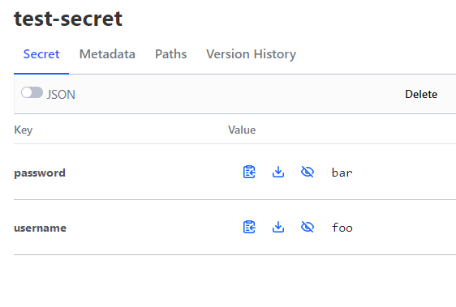

# vault-secrets-operator

Vault Secrets Operator is another way of managing Kubernetes secrets by providing a way to sync Hashicorp Vault Secrets into normal kubernetes secrets.  This allows you to store the config in Git but keep the actual secrets secure in Vault.  

Following the guide from Hashicorp here: https://developer.hashicorp.com/vault/tutorials/kubernetes/vault-secrets-operator which references the repo here: https://github.com/hashicorp-education/learn-vault-secrets-operator/tree/main

## Install Vault CLI
A lot of things can't be configured using the UI.  
1. Install the Vault CLI on Red Hat:
```bash
sudo yum install -y yum-utils
sudo yum-config-manager --add-repo https://rpm.releases.hashicorp.com/RHEL/hashicorp.repo
sudo yum -y install vault
```
2. Export the vault address as an environmental variable
```bash
export VAULT_ADDR='https://vault.apps.k8s.vdude.io'
```
3. Login to vault
```bash
vault login
```

## Configure Vault 
1. Create a kvv2 secrets engine for your secrets
```bash
vault secrets enable -path=kubernetes-secrets kv-v2
```
2. Create a Vault Policy with access to the secrets.  I am being lazy/less safe and settings things up such that my kubernetes service account will be able to see all secrets.
```bash
tee k8s-read-all.json <<EOF
path "kubernetes-secrets/*" {
   capabilities = ["read", "list"]
}
EOF
vault policy write k8s-read-all k8s-read-all.json
```
3. Enable the Kubernetes auth method and configure for your kubernetes cluster
```bash
vault auth enable -path k8s-auth-mount kubernetes
vault write auth/k8s-auth-mount/config kubernetes_host="https://kubernetes.devault.svc:443"
```
4. Create a Vault Role on the kubernetes auth mount that associates a service account to the policy. In my example, I will allow any service account named `vault-auth` in any namespace read access to all secrets.  Again, this is not particularly secure.
```bash
vault write auth/k8s-auth-mount/role/k8s-read-all \
   bound_service_account_names=vault-auth \
   bound_service_account_namespaces="*" \
   policies=k8s-read-all \
   audience=vault \
   ttl=24h
```

## Configure Kubernetes
I had some trouble with Argo not seeing CRDs before it could install it.  I don't know what the real solution is, but I manually installed using helm and then removed it, then let Argo build it.
1. Create a service account and VaultAuth object.  There is a default Vault connection set in the `values.yaml` file, so it will know where to connect by default.  Otherwise normally you would also need to define a Vault Connection and reference that in the Vault Auth.  The service account and vault auth object must be created in EACH NAMESPACE that will sync a secret, because secrets are unique to namespaces.  This is why in our earlier role we set `bound_service_account_namespaces="*"`.  Now we can just create a service account named `vault-auth` in any namespace and it will work.  My files are in `overlays/dev` but here is an example:
```yaml
---
apiVersion: v1
kind: ServiceAccount
metadata:
  name: vault-auth
  namespace: vso
---
apiVersion: secrets.hashicorp.com/v1beta1
kind: VaultAuth
metadata:
  name: vault-auth
  namespace: vso
spec:
  method: kubernetes
  mount: k8s-auth-mount
  kubernetes:
    role: k8s-read-all
    serviceAccount: vault-auth
    audiences:
      - vault
```

Now we should be ready.

## Using the Operator and Creating Secrets
Remember that you must create a service account and VaultAuth in every namespace that you want to sync secrets to.  In this example, I'm using the `vso` namespace since that's where I deployed those already.
1. In Vault, create the secret.  You can also use the UI for this.  The formatting of this command is just key="value"
```bash
vault kv put kubernetes-secrets/test-secret username="foo" password="bar"
```


2. Create a VaultStaticSecret in your namespace:
```yaml
apiVersion: secrets.hashicorp.com/v1beta1
kind: VaultStaticSecret
metadata:
  name: vault-test-secret
  namespace: vso
spec:
  type: kv-v2
  # Mount path
  mount: kubernetes-secrets
  # Path of the secret
  path: test-secret
  # Dest k8s secret, as in this is the name of the secret that will be created in Kubernetes
  destination:
    name: k8s-test-secret
    create: true
  # Refresh interval.  The secret will auto update when it is changed in Vault
  refreshAfter: 30s
  # Name of the CRD to authenticate to Vault
  vaultAuthRef: vault-auth
```